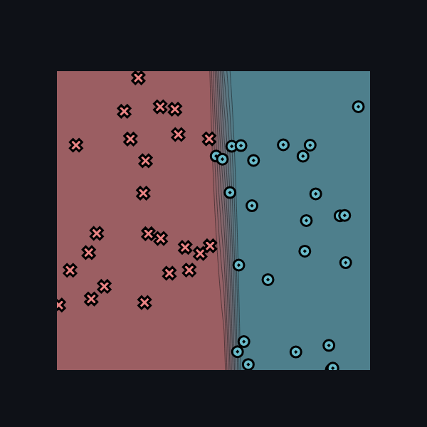
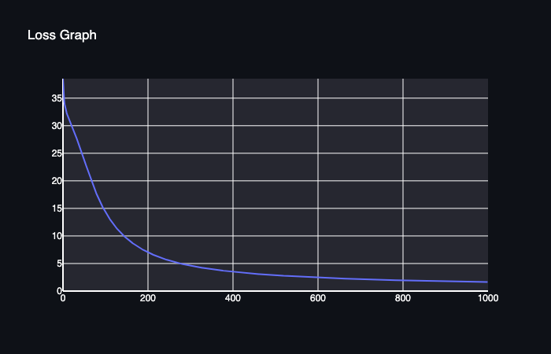
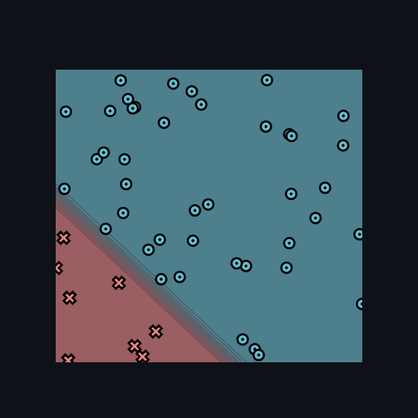
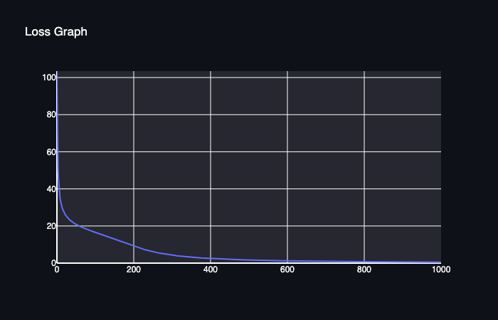
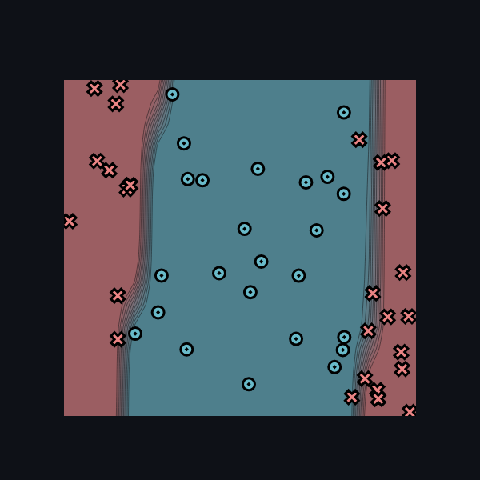
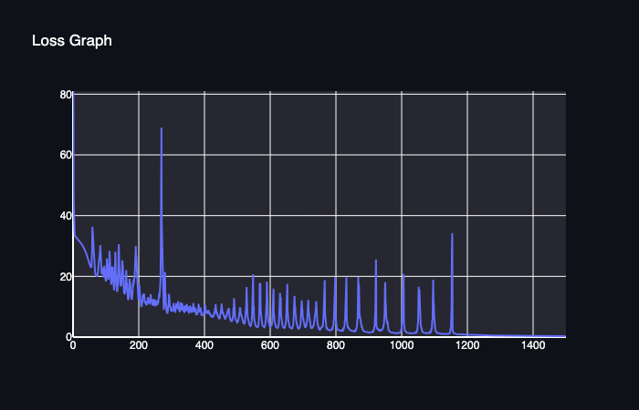
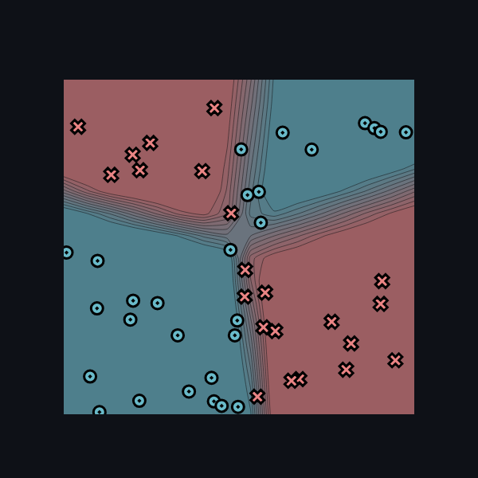
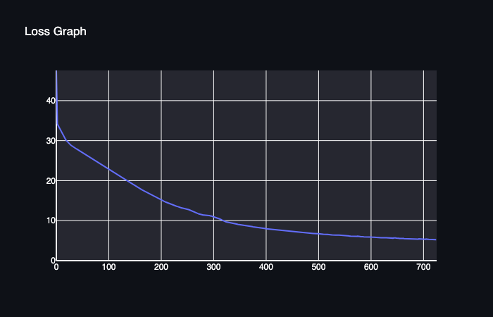

[](https://classroom.github.com/a/YFgwt0yY)
# MiniTorch Module 2


* Docs: https://minitorch.github.io/

* Overview: https://minitorch.github.io/module2/module2/

This assignment requires the following files from the previous assignments. You can get these by running

```bash
python sync_previous_module.py previous-module-dir current-module-dir
```

The files that will be synced are:

        minitorch/operators.py minitorch/module.py minitorch/autodiff.py minitorch/scalar.py minitorch/scalar_functions.py minitorch/module.py project/run_manual.py project/run_scalar.py project/datasets.py


# Section 2.5

## Simple Datasest

Parameters:

+ `# points`: 50
+ `Size of hidden layer`: 7
+ `Learning Rate`: 0.1
+ `# Epochs`: 1000




```bash
0	1000	1.6309	50
1	990	1.6437	50
2	980	1.6568	50
3	970	1.6701	50
4	960	1.6837	50
5	950	1.6976	50
6	940	1.7118	50
7	930	1.7262	50
8	920	1.7409	50
9	910	1.7559	50
10	900	1.7712	50
11	890	1.7869	50
12	880	1.8028	50
13	870	1.8192	50
14	860	1.8358	50
15	850	1.8529	50
16	840	1.8703	50
17	830	1.8881	50
18	820	1.9063	50
19	810	1.9250	50
20	800	1.9441	50
21	790	1.9636	50
22	780	1.9837	50
23	770	2.0042	50
24	760	2.0252	50
25	750	2.0468	50
26	740	2.0689	50
27	730	2.0917	50
28	720	2.1150	50
29	710	2.1389	50
30	700	2.1635	50
31	690	2.1888	50
32	680	2.2148	50
33	670	2.2417	50
34	660	2.2695	50
35	650	2.2981	50
36	640	2.3277	50
37	630	2.3581	50
38	620	2.3896	50
39	610	2.4221	50
40	600	2.4557	50
41	590	2.4905	50
42	580	2.5264	50
43	570	2.5637	50
44	560	2.6023	50
45	550	2.6423	50
46	540	2.6839	50
47	530	2.7271	50
48	520	2.7721	50
49	510	2.8190	50
50	500	2.8680	50
51	490	2.9191	50
52	480	2.9726	50
53	470	3.0285	50
54	460	3.0870	50
55	450	3.1482	50
56	440	3.2125	50
57	430	3.2799	50
58	420	3.3507	50
59	410	3.4253	50
60	400	3.5038	50
61	390	3.5867	50
62	380	3.6742	50
63	370	3.7669	50
64	360	3.8650	50
65	350	3.9691	50
66	340	4.0800	50
67	330	4.1984	50
68	320	4.3257	50
69	310	4.4620	50
70	300	4.6093	50
71	290	4.7696	49
72	280	4.9433	49
73	270	5.1317	49
74	260	5.3364	49
75	250	5.5608	49
76	240	5.8071	49
77	230	6.0774	49
78	220	6.3748	49
79	210	6.7028	49
80	200	7.0657	49
81	190	7.4692	48
82	180	7.9179	48
83	170	8.4197	48
84	160	8.9820	47
85	150	9.6130	47
86	140	10.3269	47
87	130	11.1484	47
88	120	12.0979	46
89	110	13.2001	45
90	100	14.4626	45
91	90	15.9124	45
92	80	17.6279	44
93	70	19.5934	42
94	60	21.7606	40
95	50	24.0120	40
96	40	26.2625	40
97	30	28.3415	39
98	20	30.2242	34
99	10	32.2392	33
```

## Diag

+ `# points`: 50
+ `Size of hidden layer`: 7
+ `Learning Rate`: 0.1
+ `# Epochs`: 1000




```bash
Epoch: 0/1000, loss: 0, correct: 0
Epoch: 10/1000, loss: 33.966331032409194, correct: 24
Epoch: 20/1000, loss: 27.12965669538102, correct: 43
Epoch: 30/1000, loss: 24.14944361638825, correct: 42
Epoch: 40/1000, loss: 22.310218643417176, correct: 42
Epoch: 50/1000, loss: 20.955751459116208, correct: 42
Epoch: 60/1000, loss: 19.86967142206304, correct: 42
Epoch: 70/1000, loss: 18.95295037148538, correct: 42
Epoch: 80/1000, loss: 18.133105017397266, correct: 42
Epoch: 90/1000, loss: 17.36921606083291, correct: 43
Epoch: 100/1000, loss: 16.62254083702128, correct: 43
Epoch: 110/1000, loss: 15.88010181255971, correct: 43
Epoch: 120/1000, loss: 15.121211707550943, correct: 43
Epoch: 130/1000, loss: 14.354011830963506, correct: 45
Epoch: 140/1000, loss: 13.584162504528123, correct: 46
Epoch: 150/1000, loss: 12.817112885626445, correct: 47
Epoch: 160/1000, loss: 12.045793313624314, correct: 47
Epoch: 170/1000, loss: 11.300793296974796, correct: 47
Epoch: 180/1000, loss: 10.578222769485917, correct: 47
Epoch: 190/1000, loss: 9.852512300196052, correct: 48
Epoch: 200/1000, loss: 9.139215511501233, correct: 48
Epoch: 210/1000, loss: 8.46008211113039, correct: 48
Epoch: 220/1000, loss: 7.821131144866797, correct: 48
Epoch: 230/1000, loss: 7.226915133126607, correct: 49
Epoch: 240/1000, loss: 6.678538426716954, correct: 49
Epoch: 250/1000, loss: 6.176833350732876, correct: 49
Epoch: 260/1000, loss: 5.72102389624689, correct: 50
Epoch: 270/1000, loss: 5.308725237535361, correct: 50
Epoch: 280/1000, loss: 4.937319755012306, correct: 50
Epoch: 290/1000, loss: 4.603303905387297, correct: 50
Epoch: 300/1000, loss: 4.302507299681271, correct: 50
Epoch: 310/1000, loss: 4.031505723019559, correct: 50
Epoch: 320/1000, loss: 3.7879272108403126, correct: 50
Epoch: 330/1000, loss: 3.5678157128065755, correct: 50
Epoch: 340/1000, loss: 3.368245674130585, correct: 50
Epoch: 350/1000, loss: 3.1867842250599008, correct: 50
Epoch: 360/1000, loss: 3.0212965387367468, correct: 50
Epoch: 370/1000, loss: 2.8699436283374022, correct: 50
Epoch: 380/1000, loss: 2.731090645020425, correct: 50
Epoch: 390/1000, loss: 2.6035523716760594, correct: 50
Epoch: 400/1000, loss: 2.4861303987071945, correct: 50
Epoch: 410/1000, loss: 2.3775028504742597, correct: 50
Epoch: 420/1000, loss: 2.276746502056527, correct: 50
Epoch: 430/1000, loss: 2.1832390633507073, correct: 50
Epoch: 440/1000, loss: 2.0961877744637945, correct: 50
Epoch: 450/1000, loss: 2.0148660467832125, correct: 50
Epoch: 460/1000, loss: 1.9387371292206415, correct: 50
Epoch: 470/1000, loss: 1.8673290634641726, correct: 50
Epoch: 480/1000, loss: 1.800242569359894, correct: 50
Epoch: 490/1000, loss: 1.7371785539610525, correct: 50
Epoch: 500/1000, loss: 1.6777979826784735, correct: 50
Epoch: 510/1000, loss: 1.621723699651359, correct: 50
Epoch: 520/1000, loss: 1.5687056838746158, correct: 50
Epoch: 530/1000, loss: 1.5185161201710653, correct: 50
Epoch: 540/1000, loss: 1.470916415909101, correct: 50
Epoch: 550/1000, loss: 1.4257202748650628, correct: 50
Epoch: 560/1000, loss: 1.3827589494827572, correct: 50
Epoch: 570/1000, loss: 1.3418735185759267, correct: 50
Epoch: 580/1000, loss: 1.3029514727671683, correct: 50
Epoch: 590/1000, loss: 1.2660222071985776, correct: 50
Epoch: 600/1000, loss: 1.2307624685307639, correct: 50
Epoch: 610/1000, loss: 1.1970638866150989, correct: 50
Epoch: 620/1000, loss: 1.1648303878623663, correct: 50
Epoch: 630/1000, loss: 1.1339731727896254, correct: 50
Epoch: 640/1000, loss: 1.1044118654518953, correct: 50
Epoch: 650/1000, loss: 1.076069994484916, correct: 50
Epoch: 660/1000, loss: 1.048879928071912, correct: 50
Epoch: 670/1000, loss: 1.0227755451881904, correct: 50
Epoch: 680/1000, loss: 0.9976992900538322, correct: 50
Epoch: 690/1000, loss: 0.9735943185977657, correct: 50
Epoch: 700/1000, loss: 0.9504110686942847, correct: 50
Epoch: 710/1000, loss: 0.9281054231291629, correct: 50
Epoch: 720/1000, loss: 0.9066280656176794, correct: 50
Epoch: 730/1000, loss: 0.8859352595418655, correct: 50
Epoch: 740/1000, loss: 0.8659892325306363, correct: 50
Epoch: 750/1000, loss: 0.8467529505427923, correct: 50
Epoch: 760/1000, loss: 0.828196669768176, correct: 50
Epoch: 770/1000, loss: 0.8102842956944183, correct: 50
Epoch: 780/1000, loss: 0.7929843167060557, correct: 50
Epoch: 790/1000, loss: 0.7762684878648735, correct: 50
Epoch: 800/1000, loss: 0.7601102484427394, correct: 50
Epoch: 810/1000, loss: 0.7444840145581757, correct: 50
Epoch: 820/1000, loss: 0.729366063477301, correct: 50
Epoch: 830/1000, loss: 0.7147345584891481, correct: 50
Epoch: 840/1000, loss: 0.700568181738775, correct: 50
Epoch: 850/1000, loss: 0.6868468125897087, correct: 50
Epoch: 860/1000, loss: 0.6735516180624858, correct: 50
Epoch: 870/1000, loss: 0.6607100957975401, correct: 50
Epoch: 880/1000, loss: 0.6482622460802956, correct: 50
Epoch: 890/1000, loss: 0.6361865536017757, correct: 50
Epoch: 900/1000, loss: 0.6244683242609285, correct: 50
Epoch: 910/1000, loss: 0.613145809858615, correct: 50
Epoch: 920/1000, loss: 0.6021613462675779, correct: 50
Epoch: 930/1000, loss: 0.5914887613139996, correct: 50
Epoch: 940/1000, loss: 0.5811159751932877, correct: 50
Epoch: 950/1000, loss: 0.5710315500171789, correct: 50
Epoch: 960/1000, loss: 0.5612247633837496, correct: 50
Epoch: 970/1000, loss: 0.5516855356346375, correct: 50
Epoch: 980/1000, loss: 0.5424037174921527, correct: 50
Epoch: 990/1000, loss: 0.5333702468517725, correct: 50
Epoch: 1000/1000, loss: 0.5245762255615812, correct: 50
```

## Split

Parameters:

+ `# points:` 50
+ `Size of hidden layer:` 15
+ `Learning Rate:` 0.5
+ `# Epochs:` 1500




```bash
Epoch: 0/1500, loss: 0, correct: 0
Epoch: 10/1500, loss: 33.00033159817958, correct: 28
Epoch: 20/1500, loss: 31.818574418051796, correct: 38
Epoch: 30/1500, loss: 30.194786126900418, correct: 43
Epoch: 40/1500, loss: 27.918560504912126, correct: 43
Epoch: 50/1500, loss: 24.542665333756922, correct: 43
Epoch: 60/1500, loss: 36.369963577532964, correct: 26
Epoch: 70/1500, loss: 20.561190738086392, correct: 43
Epoch: 80/1500, loss: 25.540249150078335, correct: 36
Epoch: 90/1500, loss: 22.87734698318778, correct: 39
Epoch: 100/1500, loss: 18.983473192443252, correct: 43
Epoch: 110/1500, loss: 20.74335732315192, correct: 39
Epoch: 120/1500, loss: 23.152748701111264, correct: 36
Epoch: 130/1500, loss: 28.104574014242463, correct: 33
Epoch: 140/1500, loss: 30.55264257507841, correct: 32
Epoch: 150/1500, loss: 22.105619571398222, correct: 37
Epoch: 160/1500, loss: 15.450388833407112, correct: 42
Epoch: 170/1500, loss: 12.720791424638335, correct: 46
Epoch: 180/1500, loss: 12.239329715906596, correct: 46
Epoch: 190/1500, loss: 24.940685403204967, correct: 42
Epoch: 200/1500, loss: 12.144369949121028, correct: 46
Epoch: 210/1500, loss: 10.2952914628928, correct: 48
Epoch: 220/1500, loss: 11.098058945116573, correct: 47
Epoch: 230/1500, loss: 11.332286599560216, correct: 46
Epoch: 240/1500, loss: 11.316898946406653, correct: 47
Epoch: 250/1500, loss: 10.284363533923973, correct: 46
Epoch: 260/1500, loss: 11.095807872228013, correct: 46
Epoch: 270/1500, loss: 68.97128920231944, correct: 36
Epoch: 280/1500, loss: 15.370526903863206, correct: 42
Epoch: 290/1500, loss: 8.803928648973468, correct: 47
Epoch: 300/1500, loss: 8.434371507298597, correct: 48
Epoch: 310/1500, loss: 8.79602686233647, correct: 48
Epoch: 320/1500, loss: 9.30424998594078, correct: 47
Epoch: 330/1500, loss: 9.521808325463148, correct: 47
Epoch: 340/1500, loss: 7.956354929989576, correct: 48
Epoch: 350/1500, loss: 8.494927035100472, correct: 47
Epoch: 360/1500, loss: 8.307337602423356, correct: 48
Epoch: 370/1500, loss: 8.243979610881428, correct: 48
Epoch: 380/1500, loss: 7.669779659239943, correct: 48
Epoch: 390/1500, loss: 7.789175316012988, correct: 48
Epoch: 400/1500, loss: 7.713344483243419, correct: 48
Epoch: 410/1500, loss: 7.782421509093829, correct: 48
Epoch: 420/1500, loss: 6.890139070220454, correct: 48
Epoch: 430/1500, loss: 7.082964206281343, correct: 48
Epoch: 440/1500, loss: 7.279248806742792, correct: 48
Epoch: 450/1500, loss: 7.447555042049192, correct: 48
Epoch: 460/1500, loss: 6.9871557017794155, correct: 48
Epoch: 470/1500, loss: 7.355854555785275, correct: 48
Epoch: 480/1500, loss: 5.581646299463334, correct: 48
Epoch: 490/1500, loss: 9.24231845455755, correct: 47
Epoch: 500/1500, loss: 4.84028790119332, correct: 48
Epoch: 510/1500, loss: 8.152776744324866, correct: 48
Epoch: 520/1500, loss: 4.526153054866492, correct: 48
Epoch: 530/1500, loss: 9.334774796409523, correct: 46
Epoch: 540/1500, loss: 3.6778731615061804, correct: 49
Epoch: 550/1500, loss: 9.892233956717856, correct: 45
Epoch: 560/1500, loss: 3.3598584829234235, correct: 49
Epoch: 570/1500, loss: 11.72071811226409, correct: 44
Epoch: 580/1500, loss: 3.3545926044261014, correct: 49
Epoch: 590/1500, loss: 11.60495575223404, correct: 44
Epoch: 600/1500, loss: 3.4504470063695387, correct: 49
Epoch: 610/1500, loss: 10.831683281543041, correct: 44
Epoch: 620/1500, loss: 3.098626294302975, correct: 49
Epoch: 630/1500, loss: 9.43143595837011, correct: 46
Epoch: 640/1500, loss: 3.337168558885223, correct: 49
Epoch: 650/1500, loss: 7.65180022818669, correct: 48
Epoch: 660/1500, loss: 3.3552312497089885, correct: 49
Epoch: 670/1500, loss: 3.7594321356376477, correct: 48
Epoch: 680/1500, loss: 5.510298494283771, correct: 48
Epoch: 690/1500, loss: 3.0385968695926633, correct: 48
Epoch: 700/1500, loss: 6.8399634702316785, correct: 48
Epoch: 710/1500, loss: 3.8923970355000934, correct: 48
Epoch: 720/1500, loss: 6.240399525786735, correct: 48
Epoch: 730/1500, loss: 3.3551690007130985, correct: 48
Epoch: 740/1500, loss: 9.439947096688568, correct: 46
Epoch: 750/1500, loss: 2.873116216984303, correct: 49
Epoch: 760/1500, loss: 3.753122365412515, correct: 48
Epoch: 770/1500, loss: 4.6233746367408, correct: 48
Epoch: 780/1500, loss: 2.185611282643541, correct: 49
Epoch: 790/1500, loss: 2.9509106500931335, correct: 48
Epoch: 800/1500, loss: 6.620106452349561, correct: 48
Epoch: 810/1500, loss: 2.182887075987763, correct: 49
Epoch: 820/1500, loss: 2.246843453960866, correct: 49
Epoch: 830/1500, loss: 9.518825439790422, correct: 46
Epoch: 840/1500, loss: 2.8798443548313934, correct: 48
Epoch: 850/1500, loss: 2.033211451733661, correct: 49
Epoch: 860/1500, loss: 2.2093332211787162, correct: 49
Epoch: 870/1500, loss: 14.792905814342248, correct: 44
Epoch: 880/1500, loss: 3.585582877152657, correct: 48
Epoch: 890/1500, loss: 1.7579435669764163, correct: 50
Epoch: 900/1500, loss: 1.5660902506287357, correct: 50
Epoch: 910/1500, loss: 1.646022816335094, correct: 50
Epoch: 920/1500, loss: 6.822616769455391, correct: 48
Epoch: 930/1500, loss: 2.553043256689017, correct: 48
Epoch: 940/1500, loss: 2.484533297357033, correct: 48
Epoch: 950/1500, loss: 14.199575777887201, correct: 44
Epoch: 960/1500, loss: 3.159423616282082, correct: 48
Epoch: 970/1500, loss: 1.516722051028529, correct: 50
Epoch: 980/1500, loss: 1.3509203911863334, correct: 50
Epoch: 990/1500, loss: 1.2545142477548756, correct: 50
Epoch: 1000/1500, loss: 2.697785121382929, correct: 48
Epoch: 1010/1500, loss: 2.834425569906048, correct: 49
Epoch: 1020/1500, loss: 1.3528548498820367, correct: 50
Epoch: 1030/1500, loss: 1.2423768792033942, correct: 50
Epoch: 1040/1500, loss: 1.3066508954421117, correct: 50
Epoch: 1050/1500, loss: 4.407289533553478, correct: 48
Epoch: 1060/1500, loss: 3.525842413590341, correct: 48
Epoch: 1070/1500, loss: 1.3928033540096787, correct: 50
Epoch: 1080/1500, loss: 1.3734157849187758, correct: 50
Epoch: 1090/1500, loss: 2.0699806940265373, correct: 48
Epoch: 1100/1500, loss: 6.899299410411627, correct: 48
Epoch: 1110/1500, loss: 1.290312842695593, correct: 50
Epoch: 1120/1500, loss: 1.0717441994035666, correct: 50
Epoch: 1130/1500, loss: 0.984447426977139, correct: 50
Epoch: 1140/1500, loss: 0.9908507636194863, correct: 50
Epoch: 1150/1500, loss: 2.748088411257453, correct: 48
Epoch: 1160/1500, loss: 1.2303596613998078, correct: 50
Epoch: 1170/1500, loss: 0.9855249734756554, correct: 50
Epoch: 1180/1500, loss: 0.9072331079409744, correct: 50
Epoch: 1190/1500, loss: 0.8495081603023779, correct: 50
Epoch: 1200/1500, loss: 0.7920047604025094, correct: 50
Epoch: 1210/1500, loss: 0.7417971203180777, correct: 50
Epoch: 1220/1500, loss: 0.7004914501350642, correct: 50
Epoch: 1230/1500, loss: 0.6655089792297865, correct: 50
Epoch: 1240/1500, loss: 0.6349658476017324, correct: 50
Epoch: 1250/1500, loss: 0.6071066521489574, correct: 50
Epoch: 1260/1500, loss: 0.5915523136128165, correct: 50
Epoch: 1270/1500, loss: 0.5640273262333114, correct: 50
Epoch: 1280/1500, loss: 0.5450807504030908, correct: 50
Epoch: 1290/1500, loss: 0.5270532106132536, correct: 50
Epoch: 1300/1500, loss: 0.50869451334927, correct: 50
Epoch: 1310/1500, loss: 0.49220213954363146, correct: 50
Epoch: 1320/1500, loss: 0.4778147102034099, correct: 50
Epoch: 1330/1500, loss: 0.46561651205700805, correct: 50
Epoch: 1340/1500, loss: 0.4521241996416779, correct: 50
Epoch: 1350/1500, loss: 0.4373687363876292, correct: 50
Epoch: 1360/1500, loss: 0.4261005189109248, correct: 50
Epoch: 1370/1500, loss: 0.4133731144788915, correct: 50
Epoch: 1380/1500, loss: 0.40156318523684265, correct: 50
Epoch: 1390/1500, loss: 0.39211821043344763, correct: 50
Epoch: 1400/1500, loss: 0.38144998841742445, correct: 50
Epoch: 1410/1500, loss: 0.3713987590383893, correct: 50
Epoch: 1420/1500, loss: 0.36188426742732044, correct: 50
Epoch: 1430/1500, loss: 0.3542555350846736, correct: 50
Epoch: 1440/1500, loss: 0.3452453905143774, correct: 50
Epoch: 1450/1500, loss: 0.33683882097608875, correct: 50
Epoch: 1460/1500, loss: 0.3289144564268421, correct: 50
Epoch: 1470/1500, loss: 0.32200210799654216, correct: 50
Epoch: 1480/1500, loss: 0.3148804741151122, correct: 50
Epoch: 1490/1500, loss: 0.30783177557440977, correct: 50
Epoch: 1500/1500, loss: 0.3008459683260375, correct: 50
```

## XOR

Parameters:

+ `# points:` 50
+ `Size of hidden layer:` 20
+ `Learning Rate:` 0.1
+ `# Epochs:` 725




```bash
Epoch: 0/725, loss: 0, correct: 0
Epoch: 10/725, loss: 32.379190371030454, correct: 34
Epoch: 20/725, loss: 30.058202374862137, correct: 39
Epoch: 30/725, loss: 28.73362762331628, correct: 38
Epoch: 40/725, loss: 27.887193647366438, correct: 38
Epoch: 50/725, loss: 27.019077445494084, correct: 37
Epoch: 60/725, loss: 26.194245533041983, correct: 39
Epoch: 70/725, loss: 25.3614951689722, correct: 41
Epoch: 80/725, loss: 24.56413804351459, correct: 42
Epoch: 90/725, loss: 23.78685447643405, correct: 44
Epoch: 100/725, loss: 22.948882674182883, correct: 44
Epoch: 110/725, loss: 22.11641173316801, correct: 45
Epoch: 120/725, loss: 21.307797223807473, correct: 46
Epoch: 130/725, loss: 20.47298337678022, correct: 46
Epoch: 140/725, loss: 19.642341796044427, correct: 46
Epoch: 150/725, loss: 18.83318884319941, correct: 47
Epoch: 160/725, loss: 18.044596441535987, correct: 47
Epoch: 170/725, loss: 17.281715442782083, correct: 47
Epoch: 180/725, loss: 16.55205544045428, correct: 47
Epoch: 190/725, loss: 15.865306684836803, correct: 47
Epoch: 200/725, loss: 15.2161170023087, correct: 47
Epoch: 210/725, loss: 14.614066290545265, correct: 47
Epoch: 220/725, loss: 14.111144076388143, correct: 47
Epoch: 230/725, loss: 13.595145677100627, correct: 49
Epoch: 240/725, loss: 13.159114512644782, correct: 49
Epoch: 250/725, loss: 12.971630457270942, correct: 47
Epoch: 260/725, loss: 12.307573058568266, correct: 49
Epoch: 270/725, loss: 11.776996797828874, correct: 49
Epoch: 280/725, loss: 11.463668831381684, correct: 49
Epoch: 290/725, loss: 11.295389600217035, correct: 48
Epoch: 300/725, loss: 10.968433916947744, correct: 48
Epoch: 310/725, loss: 10.571697356984904, correct: 49
Epoch: 320/725, loss: 9.893995394590458, correct: 49
Epoch: 330/725, loss: 9.525716944751577, correct: 49
Epoch: 340/725, loss: 9.25456826199326, correct: 49
Epoch: 350/725, loss: 9.012255171393676, correct: 49
Epoch: 360/725, loss: 8.788269351542862, correct: 49
Epoch: 370/725, loss: 8.582222568457793, correct: 49
Epoch: 380/725, loss: 8.371246421662635, correct: 49
Epoch: 390/725, loss: 8.20398310759471, correct: 49
Epoch: 400/725, loss: 8.004799571110945, correct: 49
Epoch: 410/725, loss: 7.8461707062625, correct: 49
Epoch: 420/725, loss: 7.678019562725652, correct: 49
Epoch: 430/725, loss: 7.522504640358712, correct: 49
Epoch: 440/725, loss: 7.388739889470387, correct: 49
Epoch: 450/725, loss: 7.250176951748699, correct: 49
Epoch: 460/725, loss: 7.128060675604732, correct: 49
Epoch: 470/725, loss: 6.999167110649503, correct: 49
Epoch: 480/725, loss: 6.882608016080288, correct: 49
Epoch: 490/725, loss: 6.771778758377298, correct: 49
Epoch: 500/725, loss: 6.716427023763189, correct: 49
Epoch: 510/725, loss: 6.5957031072433185, correct: 49
Epoch: 520/725, loss: 6.499272168659047, correct: 49
Epoch: 530/725, loss: 6.407508860902615, correct: 49
Epoch: 540/725, loss: 6.395115170535306, correct: 49
Epoch: 550/725, loss: 6.237877233185004, correct: 49
Epoch: 560/725, loss: 6.159844362538528, correct: 49
Epoch: 570/725, loss: 6.1084902544689035, correct: 49
Epoch: 580/725, loss: 6.025365890670597, correct: 49
Epoch: 590/725, loss: 5.998550987965689, correct: 49
Epoch: 600/725, loss: 5.951401680064758, correct: 49
Epoch: 610/725, loss: 5.796974190035669, correct: 49
Epoch: 620/725, loss: 5.714791224995062, correct: 49
Epoch: 630/725, loss: 5.731716565509805, correct: 49
Epoch: 640/725, loss: 5.663000426456871, correct: 49
Epoch: 650/725, loss: 5.648420182099549, correct: 49
Epoch: 660/725, loss: 5.580952566620607, correct: 49
Epoch: 670/725, loss: 5.517470733533277, correct: 49
Epoch: 680/725, loss: 5.45570253030834, correct: 49
Epoch: 690/725, loss: 5.402412873923501, correct: 49
Epoch: 700/725, loss: 5.355592495485208, correct: 49
Epoch: 710/725, loss: 5.335065969578128, correct: 49
Epoch: 720/725, loss: 5.31355637314116, correct: 49
Epoch: 725/725, loss: 5.259153884238591, correct: 49
```